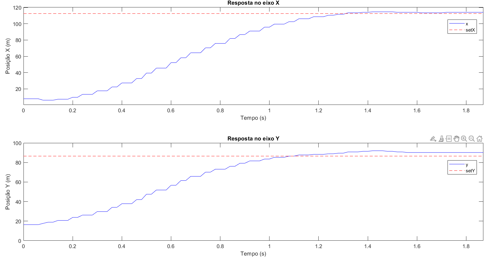

# Resposta dos Eixos – Visão Computacional (Esfera Verde)

Resposta da posição da esfera verde rastreada via visão computacional, controlada por algoritmos PID com base na posição obtida por imagem.

## Gráfico

## Vídeo da Execução

<video width="640" height="360" controls>
  <source src="./resposta_xy_visao_computacional_esfera_verde.mp4" type="video/mp4">
  Seu navegador não suporta a tag de vídeo.
</video>